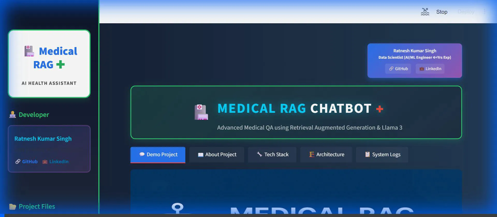

# 🏥 Medical RAG Chatbot: Advanced AI Health Assistant


[](https://appudtzei3tyyttd6xjhwur.streamlit.app/)
[](https://opensource.org/licenses/MIT)
[](https://www.python.org/downloads/release/python-3100/)
[](https://www.langchain.com/)
[](https://github.com/facebookresearch/faiss)
[](https://github.com/Ratnesh-181998/Medical-RAG-Chatbot/issues)

> **An intelligent, Retrieval-Augmented Generation (RAG) powered conversational AI designed to provide accurate medical information from verified documentation.**

---

## 📖 Table of Contents
- [✨ Introduction](#-introduction)
- [🚀 Key Features](#-key-features)
- [🏗️ System Architecture](#-system-architecture)
- [🛠️ Tech Stack](#-tech-stack)
- [📲 App Walkthrough (UI Sections)](#-app-walkthrough-ui-sections)
    - [1. Demo Project](#1-demo-project)
    - [2. About Project](#2-about-project)
    - [3. Tech Stack](#3-tech-stack)
    - [4. Architecture](#4-architecture)
    - [5. System Logs](#5-system-logs)
- [⚙️ Installation & Setup](#-installation--setup)
- [📦 Project Structure](#-project-structure)
- [🤝 Contributing](#-contributing)
- [📜 License](#-license)
- [📞 Contact](#-contact)
---
## 🌐🎬 Live Demo
🚀 **Try it now:**
- **Streamlit Profile** -[[Link]](https://share.streamlit.io/user/ratnesh-181998)
- **Project Demo** - [[Medical ChatBot Link]](https://medical-rag-chatbot-a7zyhffk6df9nqyek9jb5u.streamlit.app/)

### 🎥 Live Preview


---

## ✨ Introduction

The **Medical RAG Chatbot** is a state-of-the-art AI application built to bridge the gap between complex medical documentation and accessible, user-friendly health queries. By leveraging **Llama-3 (via Hugging Face)** for reasoning and **FAISS** for fast similarity search, this system ingests medical PDFs (e.g., "The Gale Encyclopedia of Medicine"), understands user questions, and retrieves precise, context-aware answers.

Unlike standard chatbots, this system is grounded in **RAG (Retrieval-Augmented Generation)**, meaning every answer is backed by retrieved evidence from trusted sources, significantly reducing hallucinations.

---

## 🚀 Key Features

*   **🔍 RAG-Powered Accuracy**:Retrieves relevant context from indexed medical PDFs before answering.
*   **🤖 Advanced LLM Integration**: Uses `Llama-3` (via Hugging Face API) for high-quality natural language understanding.
*   **⚡ Fast Vector Search**: Implements **FAISS (Facebook AI Similarity Search)** for millisecond-latency document retrieval.
*   **🧠 Conversation Memory**: Remembers past interactions to provide context-aware follow-up answers.
*   **📄 Source Attribution**: Shows exactly which part of the document was used to generate the answer.
*   **🖥️ System Health Dashboard**: Real-time monitoring of vector store status, LLM connectivity, and system latency.
*   **🎨 Premium UI/UX**: A polished Streamlit interface with a custom medical green theme, smooth transitions, and interactive components.

---

### Medical RAG System Architecture


---
### Interactive Logic Diagram


---
### Architecture Evolution
- 📷 Architecture View 1 — Very Simple

- 📷 Architecture View 2 — Basic Rag Flow

-  Architecture View 3 – Rag With Embeddings

-  Architecture View 4 — Full Application Architecture

- Architecture View 5 — With Memory (Chat History)

-  Architecture View 6 – Production + Devops

- Architecture View 7 — End-To-End (Best Final Diagram)


---
## 🏗️ System Architecture

The system follows a robust data pipeline:

1.  **Ingestion**: Loading medical PDFs using `PyPDFLoader`.
2.  **Chunking**: Splitting text into manageable chunks (`RecursiveCharacterTextSplitter`).
3.  **Embedding**: Converting text to vectors using `SentenceTransformer` (`all-MiniLM-L6-v2`).
4.  **Storage**: Indexing vectors in a local `FAISS` database.
5.  **Retrieval**: Fetching top-k relevant chunks for a user query.
6.  **Generation**: Synthesizing the final answer using the LLM.

.png)


*(See the **Architecture** tab in the app for an interactive deep dive into each component.)*

---

## 🛠️ Tech Stack

| Category | Technology | Purpose |
| :--- | :--- | :--- |
| **Frontend** | **Streamlit** | Interactive Web UI & Dashboard |
| **LLM Engine** | **Llama 3 (via Groq/HF)** | Natural Language Generation |
| **Embeddings** | **SentenceTransformers** | Semantic text representation |
| **Vector DB** | **FAISS** | High-performance similarity search |
| **Orchestration** | **LangChain** | Chaining retrieval and generation flows |
| **DevOps** | **Docker & Jenkins** | Containerization & CI/CD Pipelines |
| **Security** | **Aqua Trivy** | Container vulnerability scanning |
| **Cloud** | **AWS App Runner** | Scalable cloud deployment |
| **Language** | **Python 3.10** | Core programming language |

---

## 📲 App Walkthrough (UI Sections)

### 1. 💬 Demo Project
The main interface where users interact with the AI.
- **Input Area**: Type medical questions (e.g., *"What are symptoms of Pneumonia?"*).
- **Answer Display**: Receive detailed, AI-generated responses.
- **Reference Context**: Expandable section showing the raw source text used for the answer.
- **Metrics**: Real-time display of execution time and confidence.


### 2. 📖 About Project
A detailed overview of the project's mission.
- Explains the "Why" and "How" of Medical RAG.
- Highlights the datasets used (Gale Encyclopedia of Medicine).
- outlines the solution approach.


### 3. 🛠 Tech Stack
Visual representation of the technologies used.
- Cards for **LLM**, **Vector Store**, **DevOps**, and **Frontend**.
- Explains the role of Docker, Jenkins, and AWS in the deployment pipeline.


### 4. 🏛 Architecture
An educational hub for developers.
- **Interactive Flowcharts**: Visualizing the data journey from PDF to Answer.
- **Component Deep Dive**: Tabs explaining **Ingestion**, **Embedding**, and **Generation** with code snippets.
- **Evolution**: A gallery showing how the architecture evolved from MVP to Production.


### 5. 🖥️ System Health & Logs
A dashboard for administrators.
- **Status Indicators**: Green/Red lights for App, Vector Store, and LLM connectivity.
- **Live Logs**: Scrollable, filterable logs showing system activities and errors.
- **Download**: Export logs for external analysis.


---

## ⚙️ Installation & Setup

### Prerequisites
- Python 3.8 or higher.
- A Hugging Face API Token (for the LLM).

### 1. Clone the Repository
```bash
git clone https://github.com/Ratnesh-181998/Medical-RAG-Chatbot.git
cd Medical-RAG-Chatbot
```

### 2. Install Dependencies
```bash
pip install -r requirements.txt
```

### 3. Configure Environment
Create a `.env` file in the root directory and add your API token:
```ini
HF_TOKEN=your_hugging_face_token_here
```

### 4. Run the Application
```bash
streamlit run Medical_Chatbot_streamlit_app.py
```
The app will open in your browser at `http://localhost:8501`.

---

## 📦 Project Structure

```bash
Medical-RAG-Chatbot/
├── architecture_images/       # Diagrams for documentation
├── vectorstore/               # FAISS index files (if local)
├── Medical_Chatbot_streamlit_app.py  # Main Entry Point
├── requirements.txt           # Python dependencies
├── .env                       # Environment variables (GitIgnored)
└── README.md                  # Project Documentation
```

---

## 🤝 Contributing

Contributions are welcome! Please follow these steps:
1.  Fork the repository.
2.  Create a new branch (`git checkout -b feature/AmazingFeature`).
3.  Commit your changes (`git commit -m 'Add some AmazingFeature'`).
4.  Push to the branch (`git push origin feature/AmazingFeature`).
5.  Open a Pull Request.

---

## 📜 License

Distributed under the MIT License. See `LICENSE` for more information.

---

## 📞 Contact

**Ratnesh Kumar Singh**

- 📧 **Email**: [rattudacsit2021gate@gmail.com](mailto:rattudacsit2021gate@gmail.com)
- 💼 **LinkedIn**: [Ratnesh Kumar Singh](https://www.linkedin.com/in/ratneshkumar1998/)
- 🐙 **GitHub**: [Ratnesh-181998](https://github.com/Ratnesh-181998)
- 📱 **Phone**: +91-947XXXXX46

### Project Links

- 🌐 **Live Demo**: [Streamlit App](https://medical-rag-chatbot-a7zyhffk6df9nqyek9jb5u.streamlit.app/)
- 📖 **Documentation**: [GitHub Wiki](https://github.com/Ratnesh-181998/Medical-RAG-Chatbot/wiki)
- 🐛 **Issue Tracker**: [GitHub Issues](https://github.com/Ratnesh-181998/Medical-RAG-Chatbot/issues)
- 💬 **Discussions**: [GitHub Discussions](https://github.com/Ratnesh-181998/Medical-RAG-Chatbot/discussions)
